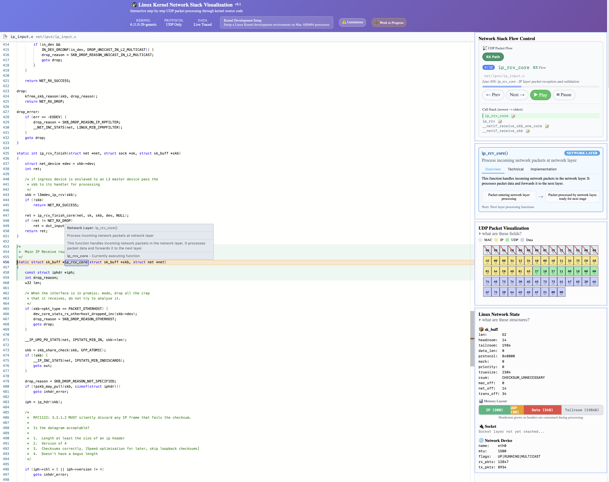

# Linux Kernel Network Stack Visualization

An interactive educational tool that visualizes UDP packet processing through the Linux kernel network stack. This project captures real kernel function traces using ftrace and presents them as an interactive step-by-step visualization with source code highlighting.

[Click to see it in action](https://dmkskd.github.io/linux-kernel-network-stack-visualization/)



## 🎯 Purpose

This visualization helps developers and students understand:

- How UDP packets flow through the Linux kernel
- The sequence of function calls in network packet processing
- Actual kernel source code at each processing step
- The relationship between network layers (L2, L3, L4)

## ✨ Features

- **Real Kernel Traces**: Captured using Linux ftrace function_graph tracer
- **Interactive Source Code**: Monaco editor with syntax highlighting
- **Step-by-Step Flow**: Navigate through each function call in the packet processing
- **Educational Annotations**: Detailed explanations for each processing step
- **Call Stack Visualization**: See the full call stack context
- **GitHub Pages Ready**: Built output optimized for static hosting

## 🚀 Quick Start

### Prerequisites

- Linux system (Ubuntu tested, other distributions may vary)
- Root access (for ftrace capture)
- Python 3.6+
- Basic networking tools (ping, nc)

**Don't have a Linux system?** Check the `examples/` folder for sample data to test the build process without capture.

### 1. Capture Network Trace

```bash
# Capture UDP packet processing trace
sudo ./capture.sh
```

This script:

- Sets up ftrace function_graph tracer
- Captures UDP packet processing functions
- Generates a timeline JSON file

### 2. Add Educational Annotations

```bash
# Generate annotations database
./annotate.sh captured_timeline_*.json
```

This creates educational content explaining each function's purpose.

### 3. Build Interactive Visualization

```bash
# Build the final visualization
./build.sh captured_timeline_*.json
```

This generates the complete visualization in the `docs/` folder.

### 4. View the Result

```bash
# Test locally
cd docs && python3 -m http.server 8080
# Open http://localhost:8080
```

Or deploy to GitHub Pages by enabling Pages in your repository settings.

## 📁 Project Structure

```
├── capture.sh              # Captures kernel function traces
├── annotate.sh             # Generates educational annotations  
├── build.sh                # Builds final visualization
├── template.html           # HTML template for the visualization
├── cleanup.sh              # Cleanup script
├── test.sh                 # Test runner
├── examples/               # Sample data for testing without capture
│   ├── sample_timeline.json     # Example captured timeline
│   ├── sample_annotations.json  # Example annotation database
│   └── README.md                # Instructions for using samples
├── docs/                   # Built visualization (GitHub Pages ready)
│   ├── index.html          # Main visualization page
│   ├── timeline_annotated.json  # Processed trace data
│   ├── annotation_database.json # Educational content
│   └── kernel_src/         # Required kernel source files
└── build/                  # Build artifacts (gitignored)
```

## 🔧 How It Works

1. **Capture Phase**: Uses Linux ftrace to record function calls during UDP packet processing
2. **Annotation Phase**: Matches functions with educational content and source locations
3. **Build Phase**: Combines traces, annotations, and kernel source into an interactive web app
4. **Visualization**: Monaco editor shows kernel source with step-by-step navigation

## 📚 Educational Value

The visualization covers the complete UDP receive path:

1. **Network Interface**: `__netif_receive_skb()` - Initial packet reception
2. **Layer 2 Processing**: Ethernet header handling
3. **Layer 3 Processing**: IP header validation and routing decisions  
4. **Layer 4 Processing**: UDP header parsing and socket delivery
5. **Socket Layer**: Final delivery to application socket buffers

Each step includes:

- Function purpose and context
- Input/output parameters
- Source code location
- Call stack context

## ⚠️ Limitations

- **Distribution Specific**: Captured on Ubuntu, may vary on other distributions
- **Kernel Version**: Tested on Linux 6.11.y, other versions may have different function signatures
- **Line Numbers**: May not match exactly due to kernel build differences
- **Educational Focus**: Simplified view focusing on main UDP processing path

## 🤝 Contributing

1. Fork the repository
2. Create a feature branch
3. Test your changes with `./test.sh`
4. Submit a pull request

## 📄 License

MIT License - See LICENSE file for details

## 🙏 Acknowledgments

- Linux kernel community for ftrace infrastructure
- Monaco Editor for code visualization
- Educational inspiration from kernel documentation

---

**Note**: This tool requires root access for ftrace capture. Always review scripts before running with sudo privileges.
